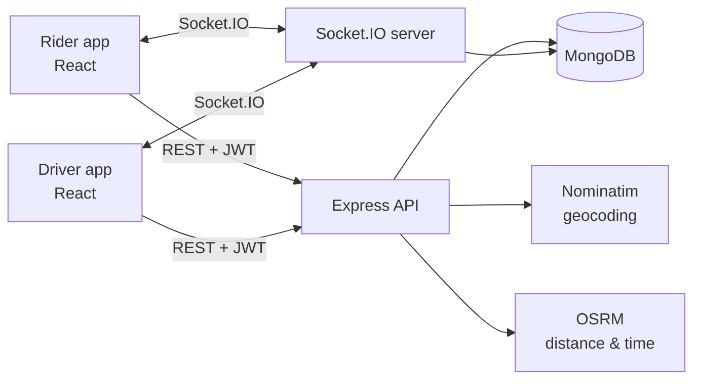
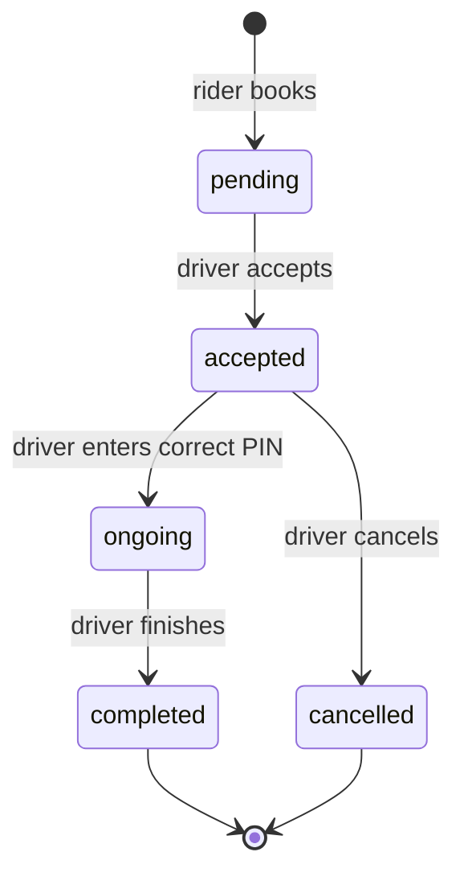

# ★ Stellar Cabs

A real-time ride-hailing app inspired by Uber, with separate **rider** and **driver** apps, live maps, nearby-driver search, OTP-verified trips and in-ride chat.

**Live demo:** https://stellar-cabs.vercel.app/ &nbsp;·&nbsp; **API:** https://stellar-cabs.onrender.com

> The backend runs on Render's free tier, which sleeps when idle. The first request can take about 50 seconds; after that it is fast.

<!-- Screenshots: put images in docs/screenshots/ and uncomment
<p align="center">
  
  
  
</p>
-->

---

## Features

**Rider**
- Live map showing your location and drivers within 5 km, refreshed every 10 seconds
- Upfront fares for three vehicle types (car, auto, bike), based on real road distance and time
- Book a ride and watch it move through the states: finding driver → driver on the way → trip in progress → arrived
- A 4-digit PIN to share with the driver, so the trip starts only with the right rider
- In-ride chat with the driver

**Driver**
- Online/offline switch; location is sent to the server every 10 seconds while the app is open
- Instant ride requests over WebSockets, sent only to online drivers with the matching vehicle type
- Accept, cancel (before pickup), start the trip with the rider's PIN, and complete it
- Earnings, trip count and total distance on the home screen

**General**
- JWT authentication for riders and drivers, with logout through a token blacklist that expires automatically
- Mobile-first UI; on desktop the app is shown inside a phone-sized frame

---

## Tech stack

| Layer | Tech |
|---|---|
| Frontend | React 19, Vite, Tailwind CSS v4, React Router, GSAP, React Leaflet, Socket.IO client, Axios |
| Backend | Node.js, Express, Socket.IO, Mongoose, JWT, bcrypt, express-validator |
| Database | MongoDB (Atlas) with a `2dsphere` geospatial index and a TTL index |
| Maps | Leaflet with OpenStreetMap or CARTO tiles, Nominatim (geocoding), OSRM (routing) |
| Hosting | Vercel (frontend), Render (backend), MongoDB Atlas |

---

## Architecture



The REST API and Socket.IO share one HTTP server. REST handles actions (book, accept, start, finish). Sockets push the results to the other side instantly and carry live driver locations and chat.

### Ride lifecycle



---

## How the interesting parts work

**Finding nearby drivers.** Each driver's location is stored as GeoJSON `[lng, lat]` with a `2dsphere` index. The rider's map asks for drivers who are online, have sent a location in the last 2 minutes, and are inside a 5 km circle:

```js
location: { $geoWithin: { $centerSphere: [[lng, lat], 5 / 6378.1] } } // radius in radians
```

Only the position and vehicle type are returned, never the driver's name or email.

**No double booking.** Every status change is a single atomic update that checks the current status first, so two drivers tapping "Accept" at the same moment cannot both get the ride:

```js
Ride.findOneAndUpdate({ _id: rideId, status: "pending" }, { status: "accepted", captain: captainId }, { new: true });
// the second driver gets null → 409 Conflict
```

The same pattern guards start, finish and cancel.

**OTP-verified start.** A 4-digit PIN is generated with `crypto.randomInt` when the ride is created. It is stored with `select: false`, so it is sent only to the rider and never to the driver. The trip moves to `ongoing` only after the backend checks the PIN the driver enters.

**Fares.** The pickup and drop addresses are geocoded with Nominatim. OSRM then returns the road distance and duration, and the fare is `base + per-km × distance + per-min × time` for each vehicle type.

---

## Socket events

| Event | Direction | Purpose |
|---|---|---|
| `join` | client → server | Link this socket to a rider or driver |
| `update-location` | driver → server | Save the driver's live location |
| `new-ride` | server → drivers | New ride request for online drivers of that vehicle type |
| `ride-confirmed` | server → rider | A driver accepted |
| `ride-started` / `ride-ended` | server → rider | Trip started or finished |
| `ride-cancelled` | server → rider | The driver cancelled |
| `send-message` / `new-message` | both | In-ride chat (with an acknowledgement) |

## REST API

| Method | Route | Auth | Description |
|---|---|---|---|
| POST | `/users/register`, `/users/login` | none | Rider sign up and log in |
| GET | `/users/profile`, `/users/logout` | rider | Profile, log out |
| POST | `/caption/register`, `/caption/login` | none | Driver sign up and log in |
| GET | `/caption/profile-caption`, `/caption/logout-caption` | driver | Profile, log out |
| PATCH | `/caption/status` | driver | Go online or offline |
| GET | `/caption/stats` | driver | Trips, distance, earnings |
| GET | `/rides/get-fare` | rider | Fares for all vehicle types |
| POST | `/rides/create` | rider | Book a ride |
| GET | `/rides/nearby-captains` | rider | Drivers within 5 km |
| POST | `/rides/confirm`, `/rides/cancel` | driver | Accept or cancel |
| POST | `/rides/start`, `/rides/finish` | driver | Start with the PIN, finish |

---

## Run it locally

**Requirements:** Node.js 18+ and MongoDB (local or Atlas).

```bash
git clone https://github.com/codERSunny812/Stellar-Cabs.git
cd Stellar-Cabs
```

**Backend**

```bash
cd backend
npm install
```

Create `backend/.env`:

```env
MONGODB_URI=mongodb://127.0.0.1:27017/stellar_cabs
JWT_SECRET=any-long-random-string
PORT=4000
# CLIENT_URL=https://your-app.vercel.app   # only in production, limits CORS to the frontend
```

```bash
npm run dev
```

**Frontend** (in a new terminal)

```bash
cd frontend
npm install
```

Create `frontend/.env`:

```env
VITE_BASE_URL=http://localhost:4000
# VITE_CARTO_KEY=your-key   # optional, for CARTO map tiles; OpenStreetMap is used without it
```

```bash
npm run dev
```

Open http://localhost:5173.

**To try a full ride:** log in as a driver in a normal window and go online. Log in as a rider in an incognito window, since both use the same `localStorage`, and book a ride.

---

## Project structure

```
Stellar-Cabs/
├── backend/
│   ├── controller/    # request handlers (user, captain, ride, map)
│   ├── service/       # business logic: fares, ride states, geocoding/routing
│   ├── models/        # User, Captain (GeoJSON location), Ride, BlacklistedToken
│   ├── Routes/        # Express routers
│   ├── middleware/    # JWT auth for riders and drivers
│   ├── features/      # Socket.IO server
│   └── server.js      # HTTP + Socket.IO entry point
└── frontend/
    └── src/
        ├── Pages/          # screens (rider home, auth, accounts)
        ├── components/     # ride panels, driver components, map, chat, ui/ kit
        ├── hooks/          # useRideChat, useSheet (bottom-sheet animation)
        ├── Context/        # socket and auth context
        └── utils/          # vehicle config, route guards
```

---

## Known limitations and next steps

- The socket `join` trusts the user ID sent by the client. Next step: verify the JWT in the Socket.IO handshake.
- Chat messages are not stored; they exist only while the ride is active.
- The public Nominatim and OSRM servers are rate-limited and meant for demos. A production build would self-host them or use a paid provider.
- There is no live driver tracking on the rider's map during a trip yet, and no payments (cash only) or ratings.
- Calling needs phone numbers, which are not collected at signup yet.

---

## Author

**Sushil Pandey** · [GitHub @codERSunny812](https://github.com/codERSunny812)
